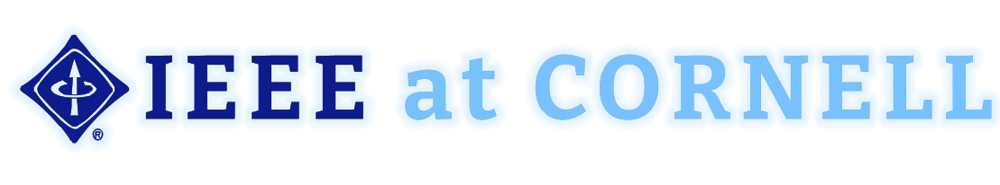

# IEEE at Cornell Wiki

This wiki covers class information for IEEE-related courses and activities at Cornell University. Our goal is to provide easy access to important resources, course materials, and student guidance.

## Classes

### 2000-Level

<ul>
  
    <li>
      <a href="{{ post.url | relative_url}}">{{ post.code }}</a>: {{ post.title }}
    </li>
  
</ul>

### 3000-Level

<ul>
  
    <li>
      <a href="{{ post.url | relative_url}}">{{ post.code }}</a>: {{ post.title }}
    </li>
  
</ul>

### 4000-Level

<ul>
  
    <li>
      <a href="{{ post.url | relative_url}}">{{ post.code }}</a>: {{ post.title }}
    </li>
  
</ul>
